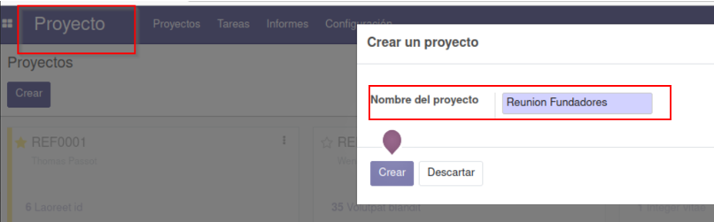

# **ODOO ASIER ARANDA Y MARIO MUÑOZ**

# --------------- **STRONG** ----------------

Para comenzar, vamos a hacer una breve explicación de nuestra pagina web.
Se trata de la página web de una empresa de gimnasios, la cual se llama ***Strong***

## **1. EXPLICACIÓN DE LA PÁGINA WEB:**

Lo primero que hicimos, fue una selección de tema entre todos los posibles, centrándonos en el que más se adaptase al estilo que queríamos para nuestra web. Elegimos uno, pero no podíamos implementarlo, ya que daba error, por lo que tuvimos que dejar el que venía por defecto.

## * Cambiar tema:

Para cambiar el tema de la aplicación hay que seguir los siguientes pasos, en primer lugar, tenemos que buscar en alguna web algún tema que nos guste y vaya bien con lo que nosotros queremos.
Una vez tenemos el tema descargado, desde nuestro sitio web, accedemos a ajustes y pinchamos donde pone **"Pick a Theme"**, y nos llevará a elegir los temas que tenemos.

A continuación, se muestra como se veía el tema que habíamos elegido.

## * Página principal:

La página principal de nuestra web es asi:
* El número 1, muestra el **nombre** de nuestra web.
* El número 2, muestra el **logo de la empresa** y a continuación el **menú de navegacion** de la web.

**Enlaces directos** hacia las secciones de nuestra web, las mismas que se muestran en la barra de navegación.

## * Añadir botón:
Se muestran las distintas ofertas de cuotas en un menú de 3 columnas:
Hemos diseñado los botones de **"Comprar"** adaptados al tema de nuestra web, lo hemos hecho mediante **HTML, CSS y JavaScript**.

En la parte inferior de la página, hemos añadido un **"footer"**, en el cual incluimos una pequeña descripción de nuestra web, junto con los links de interés y datos de contacto.

_________________________

## * Ejercicios:

A continuación de inicio, tenemos el apartado de ejercicios.
Primeramente, vemos una pequeña descripción de lo que nos vamos a encontrar a continuación, y un enlace directo hacia el formulario de contacto par solucionar al cliente cualquier tipo de duda.

Para separar los diferentes tipos de ejercicios hemos utilizado un **"carrusel"**.

_________________________

## * Recetas:

En el apartado de recetas, en primer lugar hemos hecho un pequeño **"collage"** con dos fotos, en las cuales introducimos una foto en el **"background"** y un texto explicativo de cada receta.

En segundo lugar, tenemos una **lista**, en la que hemos explicado una especie de menú.

Por último, hemos hecho un apartado de nutricionista online, el cual tiene un botón que nos dirige hacia un formulario de contacto.
De fondo, tenemos una imagen con el efecto **"parallax"**.

_________________________

## * Motivación:

En el apartado de motivación, hemos situado en primer lugar el bloque llamado **"team"** en el que mostramos personas de nuestra empresa, en las que explicamos su función, o algún hecho relevante de su carrera, para que sirva de motivación a los nuevos clientes.

En segundo lugar, tenemos un **"timeline"**, el cual nos indica los hechos más importantes de nuestra empresa.

Por último, hemos implementado un bloque **"quotes"** con frases motivadoras.

_________________________

## * Tienda:

Por último en el apartado de tienda, tenemos 3 **"steps"** en los cuales se explica de manera muy resumida los pasos a seguir para realizar la compra de cualquier producto o servicio de nuestra web.

A continuación, tenemos mostrados todos los productos y servicios que vendemos.

Como se puede observar **"Pase Anual"** tiene una etiqueta verde, este efecto se llama **"ribbon"** y es una forma de destacar el producto.

Cuando pinchamos en un producto, se nos aparece una nueva ventana, en la que podemos seleccionar la cantidad que queremos y añadirlo al carrito.

Una vez agregado el producto al carrito, pinchando en este en la parte superior de la web, se nos muestra una pantalla como la siguiente, en la que podemos pagar y finalizar el pedido, o bien volver atrás y seguir comprando.

Al pulsar el botón de pagar ahora debemos introducir nuestros datos, y una vez los tenemos damos a siguiente y confirmamos la compra.

Por último confirmamos y damos a pagar.

Al cliente se le genera un presupuesto, el cual debe firmar si está conforme, ya que es necesario para validar el pedido.

Una vez el cliente realice el pedido, a nosotros se nos modificará el gráfico y veremos lo siguiente.

 

Todo esto hemos podido llevarlo a cabo porque previamente hemos tenido que crear una cuenta bancaria dentro de un banco, que será donde nos llegará el dinero de los clientes.

También hemos tenido que habilitar los métodos de pago mediante los cuales se va a poder realizar el pago, en nuestro caso han sido transferencia bancaria y tarjeta.

El siguiente apartado al del carrito es la lista de deseos, donde podemos guardar productos para comprarlos en un futuro.

_____________________________

## * Eventos:

En ultimo lugar, encontramos la pestaña de eventos, en la cual podemos ver los eventos de nuestro gimnasio.
Podemos seleccionar los próximos eventos, los pasados o los de un tiempo concreto.

Ejemplo de un evento, en el cual podemos registrarnos de forma gratuita.
Hemos incluido un bloque de cuenta atras.

Este otro evento, está formado por un bloque **"number"**, después un bloque **"title"** y por último un bloque **"features"**.
En estos bloques se indican las carasterísticas de nuestra aplicación.
Este evento, a su vez, cuenta con un submenú para navegar entre introduccón, ubicación y registro.

_____________________________
_____________________________

## **2. PROYECTOS Y TABLEROS**

### **2.1. PROYECTOS:**

Instalamos el módulo de proyectos y también el de tableros.

A continuación, vamos al apartado proyecto, y creamos un nuevo proyecto y le damos un nombre.

Seguidamente añadimos un orden y ponemos una descripción. En la tercera imagen podemos ver como se visualiza la tarea.

A continuación, podemos ver o crear una actividad y a seleccionar una hora para ella. También planificamos más actividades.

Creamos diferentes proyectos y vemos como quedan, ya que se pueden organizar por la fase en la que se encuentra cada uno de ellos.

### **2.2. TABLEROS:**

Una vez instalado el módulo, unicamente tenemos que dar a favoritos desde la sección y añadir a tableros y ya nos aparecerá en este apartado.

Una vez añadidos, nos aparece el tablero.

_____________________________
_____________________________

## **3. GESTIÓN DE TAREAS DEL DEPARTAMENTO DE ADMINISTRACIÓN:**

Este apartado se realiza con el módulo de firmas, el cual intentamos usar pero no nos deja.

_____________________________
_____________________________

## **4. PRODUCTOS O SERVICIOS:**

Los productos y servicios que ofrece nuestro gimnasio, son todos los que podemos encontrar en el carrito de compra, ya mencionados y vistos en una foto.
Para añadir los diferentes productos hemos llevado a cabo los siguientes pasos.

Una vez dentro del apartado de productos, nos aparece la opción de crear y también podemos ver lo que ya tenemos creados.

Una vez que damos a crear, es muy sencillo, únicamente tenemos la opción de crear y también podemos ver los que ya tenemos creados.

Una vez que damos a crear, únicamente tenemos que rellenar los campos e introducir una imagen si lo deseamos.
_____________________________
_____________________________

## **5. AGENDA O CALENDARIO Y EVENTOS:**

### **5.1. AGENDA O CALENDARIO:**

Instalamos el módulo, luego nos aparece un calendario en el cual podemos seleccionar un día y crear una reunión o un nuevo evento.
También nos aparece de color los días que tenemos planificado una reunión.

_____________________________

### **5.2. EVENTOS PARA CAMPAÑAS DE MARKETING:**

Debemos instalar el módulo de eventos, y una vez instalado creamos uno, dándole un nombre y rellenando todos los datos.

A continuación, añadimos un asistente al evento, al cual enviamos un correo con el ticket para poder acceder.

A continuación, podemos ver los diferentes eventos que tiene nuestra empresa, con las fechas en las que se realizarán o se han realizado y las personas que han confirmado su asistencia.

(En la web aparece como hemos mostrado en la explicación principal).

_____________________________

### **5.3. ENCUESTAS:**

Instalamos el módulo de encuestas.

Tras tenerlo instalado, vamos a crear una encuesta, dentro de la cual haremos varias preguntas.
Se puede elegir el formato de respuesta.

Escribimos las preguntas que van a formar parte de nuestra encuesta y la guardamos.
A continuación, podemos ver como ha quedado nuestra encuesta.

Si le damos a realizar encuesta vemos lo siguiente.

_____________________________
_____________________________

## **6. CHAT INTERNO:**

Instalamos el módulo de chat interno y creamos un nuevo chat, mediante el cual podrán ponerse en contacto los clientes con nosotros, para resolver cualquier duda que tengan.
Nosotros podremos ver las conversaciones dentro del apartado conversaciones.

_____________________________
_____________________________

## **7. CONTACTOS:**

Desde el módulo de contactos, podemos crear a las diferentes personas que forman parte de nuestra empresa, a otras empresas, a clientes...

Dentro de cada cada contacto, tenemos un menú en el cual podemos ver gráficamente toda la información.

_____________________________
_____________________________

## **8. CRM:**

Instalamos el módulo de CRM, que sirve para hacer un seguimiento de los clientes y de las oportunidades próximas.

Al realizar un formulario, a través de este módulo, a nosotros nos llega una notificación para ponernos en contacto con el cliente.

La creación de **"pipelines"** se asemejan a la creación de nuevos proyectos. Son una creación de oportunidades las cuales se les puede asignar a cada uno de los trabajadores de la empresa, para que cada uno gestione su oportunidad de forma personal.

Se pueden planificar actividades dentro de cada apartado dándole un **"estado"**, nosotros hemos definido 4 diferentes (nuevo, calificado, propuesta y ganado), dependiendo en que estado esté esa oportunidad se tratará de una manera u otra.

Se pueden concretar reuniones desde este módulo, ya que va ligado al módulo de calendario.
Nuestra versión no permite generar oportunidades en CRM al rellenar un formulario desde nuestro sitio web.

_____________________________
_____________________________

## **9. Implanta los mecanismos de control de versiones y copia de seguridad del sistema.**

### **9.0. Desde nuestro ODOO accedemos a "MANAGE DATABASE" y pulsamos el botón "BACKUP"**

### **9.1. hacer backup y encriptar**

### **9.2. mover el fichero a dumps**

### **9.3. nos conectamos con usuario odoo y vamos a la carpeta dumps para hacer git status**

### **9.4. git add and git commit**

### **9.5. creo mi branch**

### **9.6. estoy en master**  

### **9.7.  cambiado a mi rama**

### **9.8.  git push nuevo**

### **9.9.  Y ya desde github podemos comprobar que tenemos guardado la copia del proyecto**    

___________________________________________________________________
___________________________________________________________________

## **10. Crea nuevas ramas con los nombres de los integrantes del equipo. Cada uno realizará una parte de la memoria README.md para finalmente unir el trabajo de ambos en la rama principal del repositorio.**

### **10.0. Mario desde su proyecto STRONG en GITHUB me hace collaborator a mi**    

### **10.1. Una vez soy colaborador haré un git clone "URL" del proyecto Strong**    

### **10.2. Mario trabajará sobre Rama "MASTER" y Asier sobre la Rama "AsierReadme" teniendo cada uno nuestro README**

#### Aquí veréis la rama AsierOdoo que es donde hemos tratado los backup del punto 8

Desde master, vamos a hacer un merge **"AsierReadme"** como se ve a continuación.

Comprobamos que tenemos en nuestra rama **"master"** los **"commits"** de la rama **"AsierReadme"** en nuestra rama **"master"**.

___________________________________________________________________
___________________________________________________________________

Por último, mostramos la gráfica de las ramas de nuestro proyecto.

